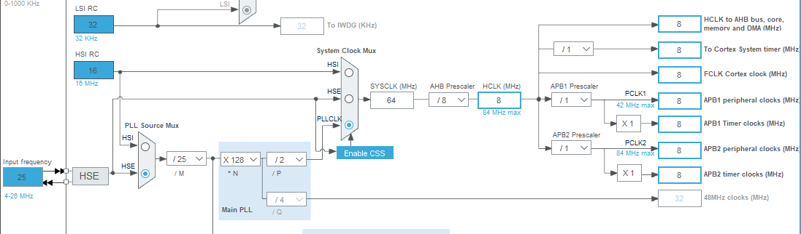
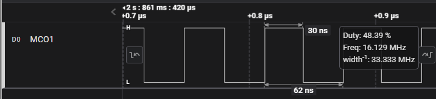
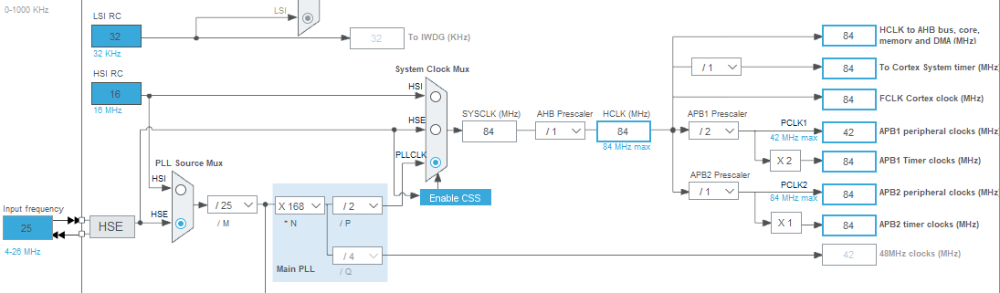
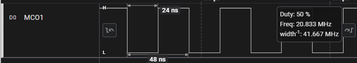
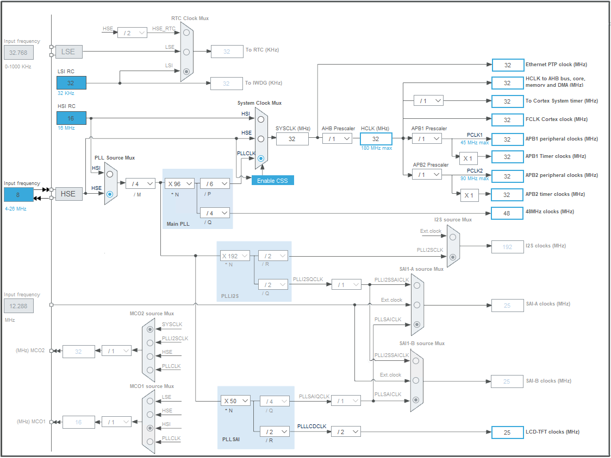
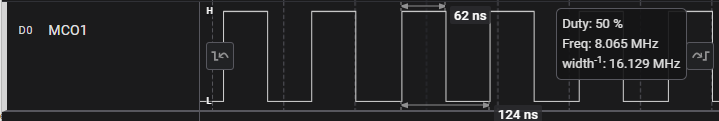
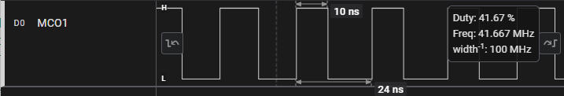

# System Clock Specification and Configuration

This page shows the clock tree for the targets STM32F401 and STM32F429

## STM32F401CCU6 Microcontroller
### Low Power Config - System Clock - 8 MHz 

   

#### Given below is the capture through MCO1 with prescalar of 4 with 64 MHz clock , thus yielding 16 MHz

   

### High Performance Config - System Clock - 84 MHz

   

#### Given below is the capture through MCO1 with prescalar of 4 with 84 MHz clock , thus yielding 21 MHz

   

## STM32F429ZIT6 Microcontroller
### Low Power Config - System Clock - 32 MHz

   

#### Given below is the capture through MCO1 with prescalar of 4 with 32 MHz clock , thus yielding 8 MHz

   

### High Performance Config - System Clock - 168 MHz

   

#### Given below is the capture through MCO1 with prescalar of 4 with 168 MHz clock , thus yielding 42 MHz

   